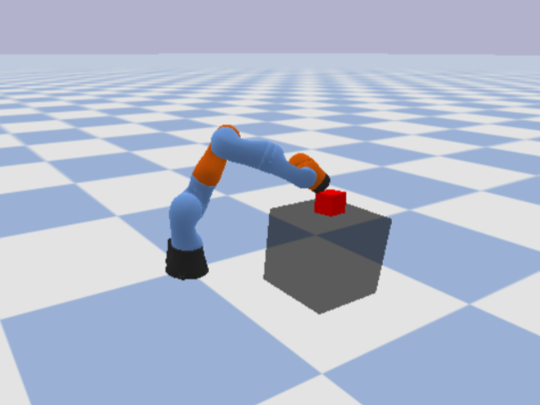

# PyBullet ロボットアームシミュレーション チュートリアル



このプロジェクトは、PyBullet を使用してロボットアームのシミュレーションを行うためのチュートリアルです。KUKA ロボットアームを制御して、テーブル上のオブジェクトに接触させる方法を示しています。

## 機能

- ロボットアーム、テーブル、オブジェクトのシミュレーション環境のセットアップ
- 逆運動学を使用したロボットアームの位置制御
- 接触検出と視覚的フィードバック
- 関節角度データの記録と可視化
- シミュレーションデータの Excel ファイルへの保存

## ファイル構成

- `main.py`: メインプログラム（全体の実行とシミュレーション管理）
- `setup.py`: シミュレーション環境のセットアップ関連
- `control.py`: ロボット制御とシミュレーション実行
- `visualization.py`: データ可視化関連
- `data_storage.py`: データ保存関連
- `requirements.txt`: 必要なライブラリとバージョン情報

## 使用方法

1. 必要なライブラリをインストール：

```
pip install -r requirements.txt
```

2. メインプログラムを実行：

```
python main.py
```

3. シミュレーションが開始され、ロボットアームがオブジェクトに接近します。
4. シミュレーション終了後、関節角度のグラフが表示され、データが Excel ファイルに保存されます。

## 出力

- `./graph/joint_angle_graph.png`: 関節角度の時間推移グラフ
- `./sheet/data.xlsx`: 関節角度データが保存された Excel ファイル

## カスタマイズ

各ファイルの冒頭にある設定パラメータを変更することで、シミュレーションの動作をカスタマイズできます：

- シミュレーション時間
- タイムステップ
- ターゲットオフセット
- ロボット制御パラメータ

## 注意事項

- PyBullet のバージョン依存性に注意してください。
- 大きな力やトルクの設定は、シミュレーションの不安定性を引き起こす可能性があります。
